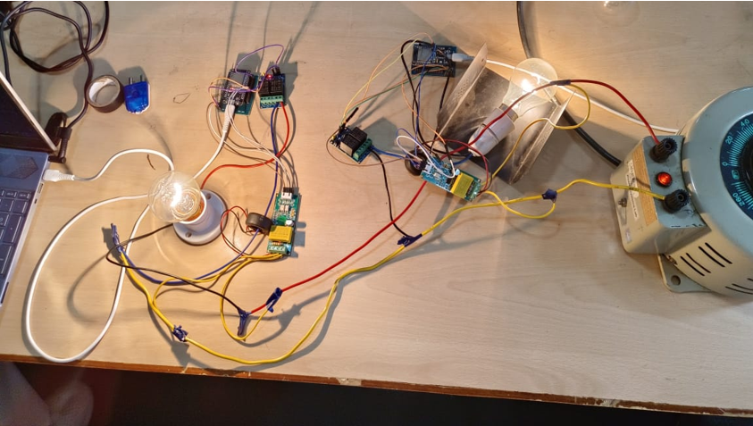

# ⚡ IoT Smart Power Strip

An ESP32-based IoT Smart Power Strip that provides **real-time energy monitoring**, **remote appliance control**, **relay-based protection**, and **cloud-ready architecture** using dual PZEM-004T energy meters.

---

## 📌 Overview

This project was developed to create a smart power strip capable of monitoring electrical parameters while allowing users to remotely control connected appliances.

The system uses two ESP32 boards:

- **Sensor Node** – Reads electrical parameters from dual PZEM-004T sensors.
- **Edge Node** – Receives data over Wi-Fi, processes it, and controls relay outputs.

The architecture is designed to be scalable and can easily integrate with cloud platforms such as MQTT, Blynk, or Node-RED.

---

## ✨ Features

- 🔌 Remote appliance ON/OFF control
- ⚡ Real-time Voltage monitoring
- 🔋 Current measurement
- 📈 Active Power calculation
- 💡 Energy consumption tracking
- 📊 Frequency monitoring
- 🔄 Wi-Fi communication between ESP32 nodes
- 🛡 Relay-based load control
- ☁ Cloud-ready architecture for IoT expansion

---

# 🏗 System Architecture

```
          +----------------------+
          |   Sensor Node ESP32  |
          |----------------------|
          |  PZEM-004T #1        |
          |  PZEM-004T #2        |
          +----------+-----------+
                     |
               Wi-Fi Communication
                     |
                     ▼
          +----------------------+
          |    Edge Node ESP32   |
          |----------------------|
          | Receives Sensor Data |
          | Controls Relays       |
          | Processes Readings    |
          +----------+-----------+
                     |
                Smart Power Strip
```

---

## 🛠 Hardware Used

| Component | Quantity |
|-----------|----------|
| ESP32 Dev Board | 2 |
| PZEM-004T Energy Meter | 2 |
| Relay Module | 1 |
| AC Loads | Multiple |
| Power Supply | 5V |
| Jumper Wires | As required |

---

## 💻 Software Used

- Arduino IDE
- ESP32 Board Package
- WiFi Library
- PZEM004Tv30 Library

---

## 📂 Repository Structure

```
├── Edge_Node.ino          # Edge node firmware
├── Sensor_Node.ino        # Sensor node firmware
├── config.ino             # Wi-Fi & configuration
├── hardware_setup.png     # Hardware connection
├── IoT_Smart_Power_Strip_Report.pdf
└── README.md
```

---

## ⚙ Working Principle

1. Sensor Node reads electrical parameters from both PZEM modules.
2. Data is transmitted wirelessly to the Edge Node.
3. Edge Node receives and processes the measurements.
4. Relay outputs are controlled based on commands.
5. The system can be extended to publish data to cloud dashboards.

---

## 📷 Hardware Setup

> Replace the image below with your hardware photograph.



---

## 🚀 Getting Started

### Clone Repository

```bash
git clone https://github.com/rcnivethitha-03/iot-smart-power-strip.git
```

---

### Open in Arduino IDE

Upload:

- `Sensor_Node.ino` → Sensor ESP32
- `Edge_Node.ino` → Edge ESP32

Update the Wi-Fi credentials inside

```cpp
const char* ssid = "YOUR_WIFI";
const char* password = "YOUR_PASSWORD";
```

Then upload the code to both ESP32 boards.

---

## 📊 Parameters Monitored

- Voltage (V)
- Current (A)
- Power (W)
- Energy (kWh)
- Frequency (Hz)
- Power Factor

---

## 🔮 Future Improvements

- MQTT Integration
- Mobile App Dashboard
- Blynk Support
- Node-RED Visualization
- Firebase Database
- Energy Consumption Analytics
- Fault Detection
- Smart Scheduling

---

## 📖 Report

A detailed project report is included in this repository.

```
IoT_Smart_Power_Strip_Report.pdf
```

---

## 👩‍💻 Author

**Nivethitha R**

Electrical and Electronics Engineering

Interested in:

- IoT
- Embedded Systems
- Power Systems
- Smart Grid Technologies

